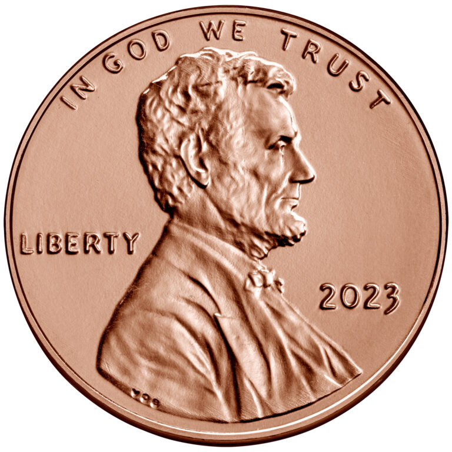

.. _device_examples:

Device Examples
===============

.. warning:: 

    This section contains unfinished subsections.

A list of devices used in :ref:`Device Sequence <device sequence>`.

Intraoral Photographic Mirror
+++++++++++++++++++++++++++++

.. figure:: ../images-static/intraoral_mirror.jpg
    :class: with-border with-shadow float-left
    :align: center
    :scale: 25 
    :alt: Phograph of an orthodontic intraoral mirror.

A device used to take photographs of areas of the oral cavity which would not be possible because of obstructing anatomy. 

The following are views which make use of such a device: 
:ref:`IV-02 <IV-02>`
, :ref:`IV-03 <IV-03>`
, :ref:`IV-04 <IV-04>`
, :ref:`IV-05 <IV-05>`
, :ref:`IV-19 <IV-19>`
, :ref:`IV-20 <IV-20>`
, :ref:`IV-22 <IV-22>`
, :ref:`IV-23 <IV-23>`
, :ref:`IV-24 <IV-24>`
, :ref:`IV-25 <IV-25>`
, :ref:`IV-26 <IV-26>`
, :ref:`IV-27 <IV-27>`

..  rst-class::  clear-both

Measuring Ruler
+++++++++++++++

A device placed inside the field of view primarily used to measure overjet. See :ref:`Overjet <overjet>`.

The following are views which make use of such a device: 
:ref:`IV-14 <IV-14>`

Contraster
++++++++++

A device used to prevent soft tissue of the oral cavity from appearing in the field of view. The device is typically flat and comes in different shapes, in order to be placed in the oral cavity behind the teeth to be photographed. The device is also used to keep other soft tissue like cheeks from covering areas of interest, thus serving a dual purpose: retractor and background. 

Any of the intraoral views can be taken with a contraster. 

Coin
++++++++++

An object most people are familiar with, sometimes placed in the field of view of the image to provide the viewer with a sense of scale/size of the anatomy in the image.

The following are views which make use of such a device: ...
