.. _intraoral views:

Intraoral Views
===============

Intraoral, Right Buccal Segment, Centric Occlusion (Direct View)
----------------------------------------------------------------

.. csv-table:: IV-01
   :file: ../tables/generated/IV-01.csv
   :widths: 40, 10, 10, 40
   :header-rows: 1

Primary Anatomic Structure Sequence
:::::::::::::::::::::::::::::::::::

See section :ref:`primary anatomic structure sequence`

Example:

Patient in mixed dentition may show the following teeth in this view:

* 54 SCT: 245616001
* 55 SCT: 245615002
* 16 SCT: 245568002
* 84 SCT: 245631005
* 85 SCT: 245630006
* 46 SCT: 245592005

Intraoral Right Buccal Segment – Centric Occlusion, With Mirror
----------------------------------------------------------------------

.. csv-table:: IV-02
   :file: ../tables/generated/IV-02.csv
   :widths: 40, 10, 10, 40
   :header-rows: 1

Primary Anatomic Structure Sequence
:::::::::::::::::::::::::::::::::::

See section :ref:`primary anatomic structure sequence`

Example: Patient in permanent dentition may show the following teeth in this view

* 14 SCT: 245571005
* 15 SCT: 245570006
* 16 SCT: 245568002
* 17 SCT: 245567007
* 18 SCT: 245566003
* 44 SCT: 245596008
* 45 SCT: 245595007
* 46 SCT: 245592005
* 47 SCT: 245591003
* 48 SCT: 245590002

Intraoral Right Buccal Segment – Centric Occlusion, With Mirror But Corrected
-----------------------------------------------------------------------------

.. csv-table:: IV-03
   :file: ../tables/generated/IV-03.csv
   :widths: 40, 10, 10, 40
   :header-rows: 1

Primary Anatomic Structure Sequence
:::::::::::::::::::::::::::::::::::

See section :ref:`primary anatomic structure sequence`

Example: Patient in permanent dentition may show the following teeth in this view

* 14 SCT: 245571005
* 15 SCT: 245570006
* 16 SCT: 245568002
* 17 SCT: 245567007
* 18 SCT: 245566003
* 44 SCT: 245596008
* 45 SCT: 245595007
* 46 SCT: 245592005
* 47 SCT: 245591003
* 48 SCT: 245590002

Intraoral, Right Buccal Segment, Centric Relation, Without Mirror
-----------------------------------------------------------------------------

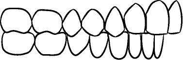

.. csv-table:: IV-04
   :file: ../tables/generated/IV-04.csv
   :widths: 40, 10, 10, 40
   :header-rows: 1

Primary Anatomic Structure Sequence
:::::::::::::::::::::::::::::::::::

See section :ref:`primary anatomic structure sequence`

Example: Patient in mixed dentition may show the following teeth in this view

* 54 SCT: 245616001
* 55 SCT: 245615002
* 16 SCT: 245568002
* 84 SCT: 245631005
* 85 SCT: 245630006
* 46 SCT: 245592005

Intraoral Right Buccal Segment – Centric Relation, With Mirror
-----------------------------------------------------------------------------

.. csv-table:: IV-05
   :file: ../tables/generated/IV-05.csv
   :widths: 40, 10, 10, 40
   :header-rows: 1

Primary Anatomic Structure Sequence
:::::::::::::::::::::::::::::::::::

See section :ref:`primary anatomic structure sequence`

Example: Patient in permanent dentition may show the following teeth in this view

* 14 SCT: 245571005
* 15 SCT: 245570006
* 16 SCT: 245568002
* 17 SCT: 245567007
* 18 SCT: 245566003
* 44 SCT: 245596008
* 45 SCT: 245595007
* 46 SCT: 245592005
* 47 SCT: 245591003
* 48 SCT: 245590002

Intraoral Right Buccal Segment – Centric Relation, With Mirror But Corrected
----------------------------------------------------------------------------

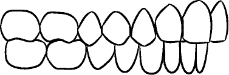

.. csv-table:: IV-06
   :file: ../tables/generated/IV-06.csv
   :widths: 40, 10, 10, 40
   :header-rows: 1

Primary Anatomic Structure Sequence
:::::::::::::::::::::::::::::::::::

See section :ref:`primary anatomic structure sequence`

Example: Patient in permanent dentition may show the following teeth in this view

* 54 SCT: 245616001
* 55 SCT: 245615002
* 84 SCT: 245631005
* 85 SCT: 245630006

Intraoral Frontal View - Centric Occlusion, Without Mirror
----------------------------------------------------------------------------

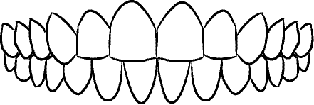

.. csv-table:: IV-07
   :file: ../tables/generated/IV-07.csv
   :widths: 40, 10, 10, 40
   :header-rows: 1

Primary Anatomic Structure Sequence
:::::::::::::::::::::::::::::::::::

See section :ref:`primary anatomic structure sequence`

Example: Patient in permanent dentition may show the following teeth in this view

* 51 SCT: 245620002
* 52 SCT: 245619008
* 53 SCT: 245617005
* 61 SCT: 245627004
* 62 SCT: 245626008
* 63 SCT: 245624006
* 71 SCT: 245642001
* 72 SCT: 245641008
* 73 SCT: 245639007
* 81 SCT: 245635001
* 82 SCT: 245634002
* 83 SCT: 245632003

Intraoral Frontal View - Centric Relation, Without Mirror
----------------------------------------------------------------------------

.. csv-table:: IV-08
   :file: ../tables/generated/IV-08.csv
   :widths: 40, 10, 10, 40
   :header-rows: 1

Primary Anatomic Structure Sequence
:::::::::::::::::::::::::::::::::::

See section :ref:`primary anatomic structure sequence`

Example: Patient in permanent dentition may show the following teeth in this view

* 11 SCT: 245575001
* 12 SCT: 245574002
* 13 SCT: 245572003
* 21 SCT: 245587008
* 22 SCT: 245586004
* 23 SCT: 245584001
* 31 SCT: 245611006
* 32 SCT: 245610007
* 33 SCT: 245608005
* 41 SCT: 245600003
* 42 SCT: 245599001
* 43 SCT: 245597004

Intraoral Frontal View – Teeth Apart, Without Mirror
----------------------------------------------------------------------------

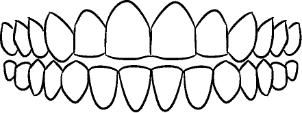

.. csv-table:: IV-09
   :file: ../tables/generated/IV-09.csv
   :widths: 40, 10, 10, 40
   :header-rows: 1

Primary Anatomic Structure Sequence
:::::::::::::::::::::::::::::::::::

See section :ref:`primary anatomic structure sequence`

Example: Patient in permanent dentition may show the following teeth in this view

* 11 SCT: 245575001
* 12 SCT: 245574002
* 53 SCT: 245617005
* 21 SCT: 245587008
* 22 SCT: 245586004
* 63 SCT: 245624006
* 31 SCT: 245611006
* 32 SCT: 245610007
* 73 SCT: 245639007
* 41 SCT: 245600003
* 42 SCT: 245599001
* 83 SCT: 245632003

Intraoral Frontal View – Mouth Open, Without Mirror
----------------------------------------------------------------------------

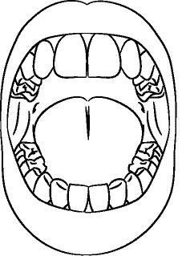

.. csv-table:: IV-10
   :file: ../tables/generated/IV-10.csv
   :widths: 40, 10, 10, 40
   :header-rows: 1

Primary Anatomic Structure Sequence
:::::::::::::::::::::::::::::::::::

See section :ref:`primary anatomic structure sequence`

Example: Patient in permanent dentition may show the following teeth in this view

* 11 SCT: 245575001
* 12 SCT: 245574002
* 13 SCT: 245572003
* 21 SCT: 245587008
* 22 SCT: 245586004
* 23 SCT: 245584001
* 31 SCT: 245611006
* 32 SCT: 245610007
* 33 SCT: 245608005
* 41 SCT: 245600003
* 42 SCT: 245599001
* 43 SCT: 245597004

IV-11
----------------------------------------------------------------------------

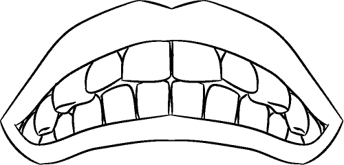

.. csv-table:: IV-11
   :file: ../tables/generated/IV-11.csv
   :widths: 40, 10, 10, 40
   :header-rows: 1

Primary Anatomic Structure Sequence
:::::::::::::::::::::::::::::::::::

See section :ref:`primary anatomic structure sequence`

Example: Patient in permanent dentition may show the following teeth in this view

* _

IV-12
----------------------------------------------------------------------------

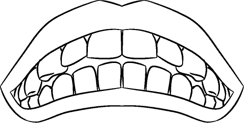

.. csv-table:: IV-12
   :file: ../tables/generated/IV-12.csv
   :widths: 40, 10, 10, 40
   :header-rows: 1

Primary Anatomic Structure Sequence
:::::::::::::::::::::::::::::::::::

See section :ref:`primary anatomic structure sequence`

Example: Patient in permanent dentition may show the following teeth in this view

* _

IV-13
----------------------------------------------------------------------------

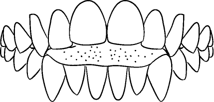

.. csv-table:: IV-13
   :file: ../tables/generated/IV-13.csv
   :widths: 40, 10, 10, 40
   :header-rows: 1

Primary Anatomic Structure Sequence
:::::::::::::::::::::::::::::::::::

See section :ref:`primary anatomic structure sequence`

Example: Patient in permanent dentition may show the following teeth in this view

* _

Intraoral Right Lateral View – Centric Occlusion, Showing Overjet Without Mirror
--------------------------------------------------------------------------------

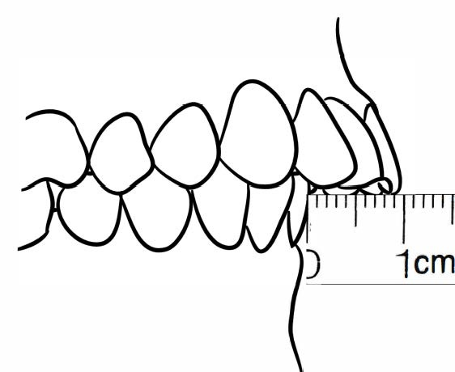

.. csv-table:: IV-14
   :file: ../tables/generated/IV-14.csv
   :widths: 40, 10, 10, 40
   :header-rows: 1

Primary Anatomic Structure Sequence
:::::::::::::::::::::::::::::::::::

See section :ref:`primary anatomic structure sequence`

Example:

Patient in mixed dentition may show the following teeth in this view:

* 54 SCT: 245616001
* 55 SCT: 245615002
* 16 SCT: 245568002
* 84 SCT: 245631005
* 85 SCT: 245630006
* 46 SCT: 245592005

Intraoral Right Lateral View – Centric Relation, Showing Overjet Without Mirror
-------------------------------------------------------------------------------

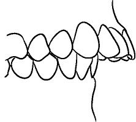

.. csv-table:: IV-15
   :file: ../tables/generated/IV-15.csv
   :widths: 40, 10, 10, 40
   :header-rows: 1

Primary Anatomic Structure Sequence
:::::::::::::::::::::::::::::::::::

See section :ref:`primary anatomic structure sequence`

Example: Patient in mixed dentition may show the following teeth in this view

* 54 SCT: 245616001
* 55 SCT: 245615002
* 16 SCT: 245568002
* 84 SCT: 245631005
* 85 SCT: 245630006
* 46 SCT: 245592005

IV-16
----------------------------------------------------------------------------

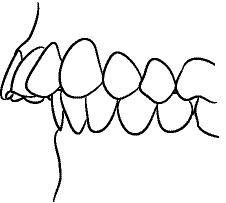

.. csv-table:: IV-16
   :file: ../tables/generated/IV-16.csv
   :widths: 40, 10, 10, 40
   :header-rows: 1

Primary Anatomic Structure Sequence
:::::::::::::::::::::::::::::::::::

See section :ref:`primary anatomic structure sequence`

Example: Patient in permanent dentition may show the following teeth in this view

* _

IV-17
----------------------------------------------------------------------------

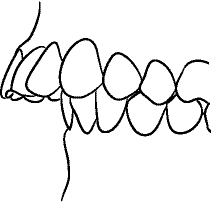

.. csv-table:: IV-17
   :file: ../tables/generated/IV-17.csv
   :widths: 40, 10, 10, 40
   :header-rows: 1

Primary Anatomic Structure Sequence
:::::::::::::::::::::::::::::::::::

See section :ref:`primary anatomic structure sequence`

Example: Patient in permanent dentition may show the following teeth in this view

* _

IV-18
----------------------------------------------------------------------------

.. csv-table:: IV-18
   :file: ../tables/generated/IV-18.csv
   :widths: 40, 10, 10, 40
   :header-rows: 1

Primary Anatomic Structure Sequence
:::::::::::::::::::::::::::::::::::

See section :ref:`primary anatomic structure sequence`

Example: Patient in permanent dentition may show the following teeth in this view

* _

IV-19
----------------------------------------------------------------------------

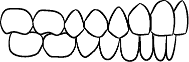

.. csv-table:: IV-19
   :file: ../tables/generated/IV-19.csv
   :widths: 40, 10, 10, 40
   :header-rows: 1

Primary Anatomic Structure Sequence
:::::::::::::::::::::::::::::::::::

See section :ref:`primary anatomic structure sequence`

Example: Patient in permanent dentition may show the following teeth in this view

* _

IV-20
----------------------------------------------------------------------------

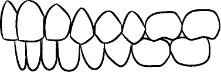

.. csv-table:: IV-20
   :file: ../tables/generated/IV-20.csv
   :widths: 40, 10, 10, 40
   :header-rows: 1

Primary Anatomic Structure Sequence
:::::::::::::::::::::::::::::::::::

See section :ref:`primary anatomic structure sequence`

Example: Patient in permanent dentition may show the following teeth in this view

* _

IV-21
----------------------------------------------------------------------------

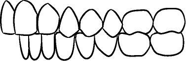

.. csv-table:: IV-21
   :file: ../tables/generated/IV-21.csv
   :widths: 40, 10, 10, 40
   :header-rows: 1

Primary Anatomic Structure Sequence
:::::::::::::::::::::::::::::::::::

See section :ref:`primary anatomic structure sequence`

Example: Patient in permanent dentition may show the following teeth in this view

* _

IV-22
----------------------------------------------------------------------------

.. figure:: ../images/IV-22.png
	:class: with-border
	:figwidth: 100%
	:alt: Line drawing of Intraoral Right Buccal Segment – Centric Relation, With Mirror

.. csv-table:: IV-22
   :file: ../tables/generated/IV-22.csv
   :widths: 40, 10, 10, 40
   :header-rows: 1

Primary Anatomic Structure Sequence
:::::::::::::::::::::::::::::::::::

See section :ref:`primary anatomic structure sequence`

Example: Patient in permanent dentition may show the following teeth in this view

* _

IV-23
----------------------------------------------------------------------------

.. csv-table:: IV-23
   :file: ../tables/generated/IV-23.csv
   :widths: 40, 10, 10, 40
   :header-rows: 1

Primary Anatomic Structure Sequence
:::::::::::::::::::::::::::::::::::

See section :ref:`primary anatomic structure sequence`

Example: Patient in permanent dentition may show the following teeth in this view

* _

IV-24
----------------------------------------------------------------------------

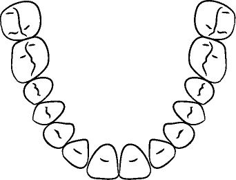

.. csv-table:: IV-24
   :file: ../tables/generated/IV-24.csv
   :widths: 40, 10, 10, 40
   :header-rows: 1

Primary Anatomic Structure Sequence
:::::::::::::::::::::::::::::::::::

See section :ref:`primary anatomic structure sequence`

Example: Patient in permanent dentition may show the following teeth in this view

* _

IV-25
----------------------------------------------------------------------------

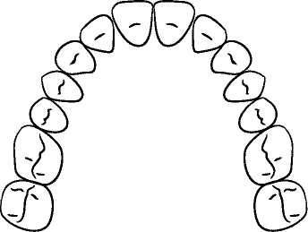

.. csv-table:: IV-25
   :file: ../tables/generated/IV-25.csv
   :widths: 40, 10, 10, 40
   :header-rows: 1

Primary Anatomic Structure Sequence
:::::::::::::::::::::::::::::::::::

See section :ref:`primary anatomic structure sequence`

Example: Patient in permanent dentition may show the following teeth in this view

* _

IV-26
----------------------------------------------------------------------------

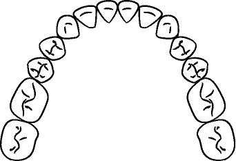

.. csv-table:: IV-26
   :file: ../tables/generated/IV-26.csv
   :widths: 40, 10, 10, 40
   :header-rows: 1

Primary Anatomic Structure Sequence
:::::::::::::::::::::::::::::::::::

See section :ref:`primary anatomic structure sequence`

Example: Patient in permanent dentition may show the following teeth in this view

* _

IV-27
----------------------------------------------------------------------------

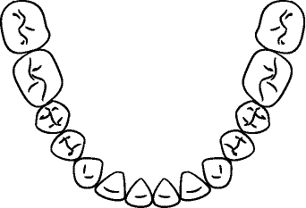

.. csv-table:: IV-27
   :file: ../tables/generated/IV-27.csv
   :widths: 40, 10, 10, 40
   :header-rows: 1

Primary Anatomic Structure Sequence
:::::::::::::::::::::::::::::::::::

See section :ref:`primary anatomic structure sequence`

Example: Patient in permanent dentition may show the following teeth in this view

* _

IV-28
----------------------------------------------------------------------------

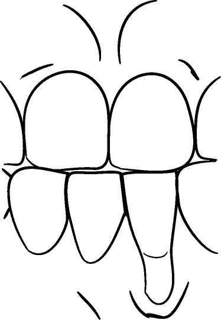

.. csv-table:: IV-28
   :file: ../tables/generated/IV-28.csv
   :widths: 40, 10, 10, 40
   :header-rows: 1

Primary Anatomic Structure Sequence
:::::::::::::::::::::::::::::::::::

See section :ref:`primary anatomic structure sequence`

Example: Patient in permanent dentition may show the following teeth in this view

* _

IV-29
----------------------------------------------------------------------------

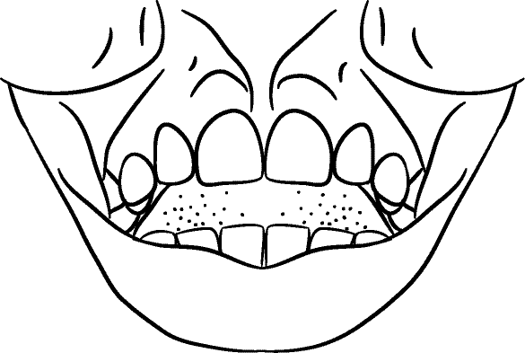

.. csv-table:: IV-29
   :file: ../tables/generated/IV-29.csv
   :widths: 40, 10, 10, 40
   :header-rows: 1

Primary Anatomic Structure Sequence
:::::::::::::::::::::::::::::::::::

See section :ref:`primary anatomic structure sequence`

Example: Patient in permanent dentition may show the following teeth in this view

* _

IV-30
----------------------------------------------------------------------------

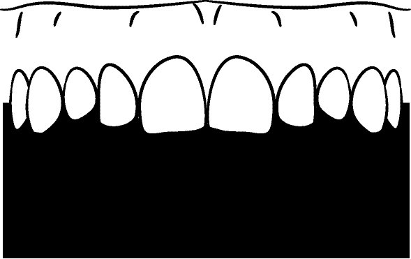

.. csv-table:: IV-30
   :file: ../tables/generated/IV-30.csv
   :widths: 40, 10, 10, 40
   :header-rows: 1

Primary Anatomic Structure Sequence
:::::::::::::::::::::::::::::::::::

See section :ref:`primary anatomic structure sequence`

Example: Patient in permanent dentition may show the following teeth in this view

* _

