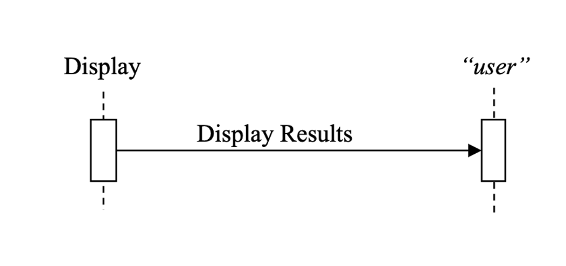

Volume 2 - Transactions
=======================

This document, Volume 2 of the IHE Dental (DEN) Technical Framework, defines transactions used in IHE Dental Domain profiles.

1 Introduction to Volume 2
==========================
This document, Volume 2 of the IHE Dental (DEN) Technical Framework, defines
transactions used in IHE Dental Domain profiles.

1.1 Introduction to IHE
-----------------------
Integrating the Healthcare Enterprise (IHE) is an international initiative to promote the use of
standards to achieve interoperability among health information technology (HIT) systems and
effective use of electronic health records (EHRs). IHE provides a forum for care providers, HIT
experts and other stakeholders in several clinical and operational domains to reach consensus on
standards-based solutions to critical interoperability issues.

The primary output of IHE is system implementation guides, called IHE Profiles. IHE publishes 
each profile through a well-defined process of public review and trial implementation and
gathers profiles that have reached final text status into an IHE Technical Framework, of which
this volume is a part.

For general information regarding IHE, refer to `www.ihe.net <http://www.ihe.net/>`_. It is strongly recommended that,
prior to reading this volume, the reader familiarizes themselves with the concepts defined in the 
`IHE Technical Frameworks General Introduction <https://profiles.ihe.net/GeneralIntro/index.html>`_.

1.2 Intended Audience
---------------------
The intended audience of IHE Technical Frameworks Volume 2 is:

• IT departments of healthcare institutions
• Developers and technical staff of vendors participating in the IHE initiative
• Experts involved in standards development

1.3 Overview of Technical Framework Volume 2
--------------------------------------------
Volume 2 is comprised of several distinct sections:
  
• Section 1 provides background and reference material.
• Section 2 presents the conventions used in this volume to define the transactions.
• Section 3 defines Dental transactions in detail, specifying the roles for each actor, the standards employed, the information exchanged, and in some cases, implementation options for the transaction.
• The appendices provide clarification of technical details of the IHE data model and transactions.

For a brief overview of other Technical Framework Volumes (TF-1, TF-3), please see
the IHE Technical Frameworks General Introduction, `Section 5 - Structure of the IHE Technical
Frameworks <https://profiles.ihe.net/GeneralIntro/ch-5.html>`_.

1.4 Comment Process
-------------------
*TO DO: specify here how public comment will work.*

1.5 Copyright Licenses
----------------------
IHE technical documents refer to, and make use of, a number of standards developed and
published by several standards development organizations. Please refer to the IHE Technical
Frameworks General Introduction, `Section 9 - Copyright Licenses <https://profiles.ihe.net/GeneralIntro/ch-9.html>`_ for copyright license
information for frequently referenced base standards. Information pertaining to the use of IHE
International copyrighted materials is also available there.

1.6 Trademark
-------------
IHE® and the IHE logo are trademarks of the Healthcare Information Management Systems
Society in the United States and trademarks of IHE Europe in the European Community. Please
refer to the IHE Technical Frameworks General Introduction, `Section 10 - Trademark <https://profiles.ihe.net/GeneralIntro/ch-10.html>`_ for
information on their use.

1.7 Disclaimer Regarding Patent Rights
--------------------------------------
Attention is called to the possibility that implementation of the specifications in this document
may require use of subject matter covered by patent rights. By publication of this document, no
position is taken with respect to the existence or validity of any patent rights in connection
therewith. IHE International is not responsible for identifying Necessary Patent Claims for which
a license may be required, for conducting inquiries into the legal validity or scope of Patents
Claims or determining whether any licensing terms or conditions provided in connection with
submission of a Letter of Assurance, if any, or in any licensing agreements are reasonable or
non-discriminatory. Users of the specifications in this document are expressly advised that
determination of the validity of any patent rights, and the risk of infringement of such rights, is
entirely their own responsibility. Further information about the IHE International patent
disclosure process including links to forms for making disclosures is available at
http://www.ihe.net/Patent_Disclosure_Process. Please address questions about the patent
disclosure process to the secretary of the IHE International Board: secretary@ihe.net.

1.6 History of Document Changes
-------------------------------

.. list-table::
    :header-rows: 1

    * - **Date**
      - **Document Revision**
      - **Change Summary**
    * - TBD
      - TBD
      - TBD

2 Conventions
=============
This document has adopted the following conventions for representing the framework concepts
and specifying how the standards upon which the IHE Technical Framework is based shall be
applied.

2.1 Transaction Modeling and Profile Conventions
------------------------------------------------
In order to maintain consistent documentation, modeling methods for IHE transactions and profiling conventions for frequently used standards are maintained in the IHE Technical
Frameworks General Introduction, `Appendix E - Standards Profiling and Documentation
Conventions <https://profiles.ihe.net/GeneralIntro/ch-E.html>`_. Methods described include the Unified Modeling Language (UML) and standards
conventions include DICOM, HL7 v2.x, HL7 Clinical Document Architecture (CDA)
Documents, etc. These conventions are critical to understanding this volume and should be reviewed prior to reading this text.

2.2 Use of Coded Entities and Coding Schemes
--------------------------------------------
Where applicable, coding schemes required by the DICOM ®, HL7®, LOINC®, and SNOMED®
standards are used in IHE Profiles. In the cases where such resources are not explicitly identified
by standards, implementations may utilize any resource (including proprietary or local) provided
any licensing/copyright requirements are satisfied.

3 IHE Dental Transactions
=========================
This section defines each transaction in detail, specifying the standards used, and the information
transferred.

.. _den_1:

3.1 Display Visible Light Images [DEN-1]
----------------------------------------
3.1.1 Scope
~~~~~~~~~~~
This transaction is used to present DICOM Visual Light Photographic Images to a dental professional interpreting a study.  This includes 2-dimensional radiographic images such as intraoral and panoramic image, cone beam computed tomography (CBCT) data); as well as visible light images, such as photographs in an organized and structured manner for all aspect of oral healthcare, including those in private practice settings.  The images rendered in this transaction are produced by a OIP Content Creator actor supporting the :ref:`direct_photography_option`; see DEN TF-1: 3.2.1 Direct Photography Option.

*<NOTE to Toni:  The above list comes from the ADA spec, Introduction section pg 7>*

This transaction is not a typical network-based transaction between two devices; instead, the primary focus of the requirements is on the behavior of the display application rather than messaging between two actors. This can be thought
of as an “informational transaction” between a display device and a user.

The Display may have behaviors in addition to those required by this transaction.  

Methods for selecting and obtaining the data to be displayed are outside the scope of this transaction.

3.1.2 Actor Roles
~~~~~~~~~~~~~~~~~
The roles in this transaction are defined in the following table and may be played by the actors shown here:

**Table 3.1.2-1: Actor Roles**

.. list-table::
    :header-rows: 0

    * - **Role**
      - Display:  
           Presents results visually to a user.

    * - **Actor(s)**
      - The following actors may play the role of Display:   
           Image Display

3.1.3 Referenced Standards
~~~~~~~~~~~~~~~~~~~~~~~~~~
+ ANSI/ADA Standard No. 1100, Rev. ??, "Dentistry - 2D and 3D Orthodontic/Cranial/Forensic Photographic Views and View Sets
+ TO DO: Add list of standards here...

3.1.4 Messages
~~~~~~~~~~~~~~

**Figure  3.1.4-1 Interaction Diagram**

3.1.4.1 Display Results
+++++++++++++++++++++++
The Display presents one or more DICOM studies to the user.

3.1.4.1.1 Trigger Events
^^^^^^^^^^^^^^^^^^^^^^^^
A user or an automated function determines that one or more studies should be presented.

3.1.4.1.2 Message Semantics
^^^^^^^^^^^^^^^^^^^^^^^^^^^
The DICOM VL Photographic Image IODs are encoded as described in DEN TF-3: 7.3.1 .

This transaction does not depend on how the DICOM images were transferred to the Display. If the Display
receives results by a profiled mechanism such as DICOM C-STORE, the messaging protocol is specified in that corresponding transaction. If results are accessed by being grouped with another actor such as a Content Consumer or an Image Manager / Image Archive, there is no messaging protocol involved.

3.1.4.1.3 Expected Actions (i.e., Display Requirements)
^^^^^^^^^^^^^^^^^^^^^^^^^^^^^^^^^^^^^^^^^^^^^^^^^^^^^^^

The behaviors in this section are specified as baseline capabilities.  Displays may have additional or alternate capabilities that may be invoked or configured.

Displays shall support the capabilities described in this section for DICOM images encoded in instances of the following:

* VL Photographic Image IOD as defined in DEN TF-3: 7.3.1.

3.1.4.1.3.1 General Display Requirements
****************************************
The Display shall:

+ <*OPEN ISSUE: enumerate here general requirements beyond the viewset requirements below, e.g. for annotation perhaps. Next, add logical subsections.   There are examples of how this is done for NM display in RAD TF-2: 4.16.4.2.2.3, for mammo in RAD TF-2: 4.16.4.2.2.1, and for basic image review in RAD TF-2: 4.16.4.2.2.6.*

3.1.4.1.3.2 Viewset VS-01
*************************
VS-01 (from DICOM correction package 1571) is the template preferred by the ABO for Case Submission and Display. It is the viewset most commonly used by orthodontic practitioners and vendors of orthodontic software.

The Display shall be able to display for the user Viewset VS-01, with eight images and one text box, as defined in **ANSI/ADA Standard No. 1100**, Section 10.

3.1.4.1.3.3 Viewset VS-02
*************************
VS-02 is a custom craniofacial viewset has greatest use for documentation of orthognathic and craniofacial surgery treatment.

The Display shall be able to display for the user Viewset VS-01, with 13 views as defined in **ANSI/ADA Standard No. 1100**, Section 10.

3.1.4.1.3.4 Viewset VS-03
*************************
VS-03 is a custom supplementary patient record display, presents specific views commonly requested by insurance companies for documentation of automatic qualifiers (such as excessive overjet or impinging deep bite).

The Display shall be able to display for the user Viewset VS-03, with 13 image boxes as defined in **ANSI/ADA Standard No. 1100**, Section 10.

3.1.4.1.3.5 Viewset VS-04
*************************
VS-04 is a custom supplementary patient record display, was designed to facilitate assessment of craniofacial asymmetries. 

The Display shall be able to display for the user Viewset VS-04, with 12 image boxes as defined in **ANSI/ADA Standard No. 1100**, Section 10.
