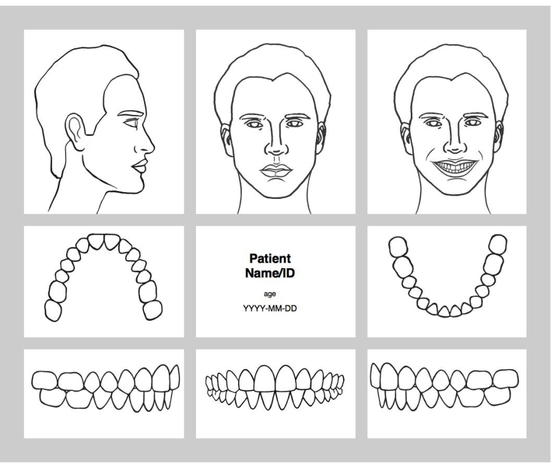
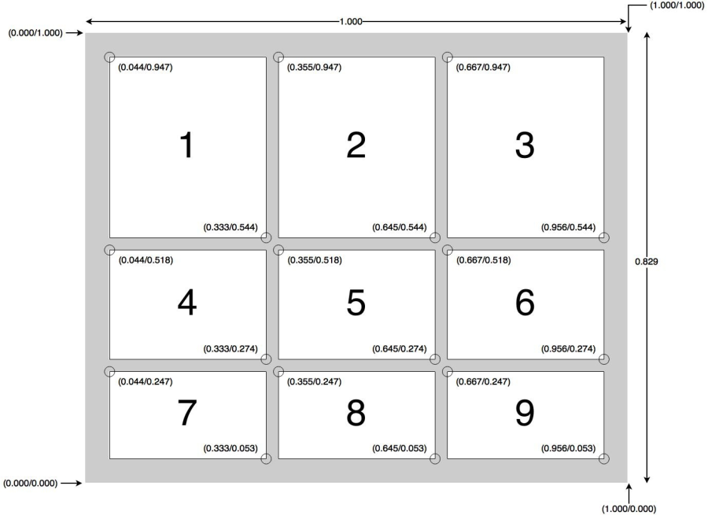
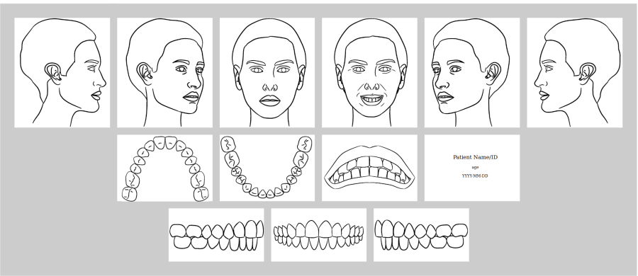
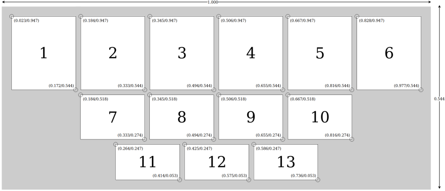
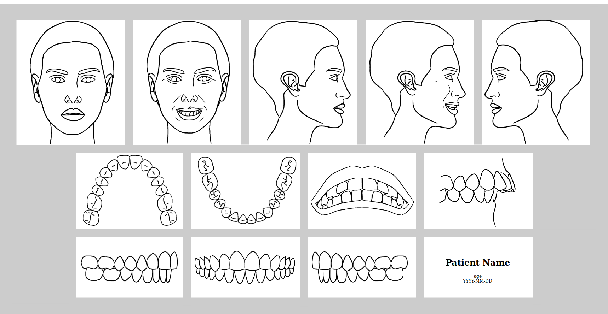
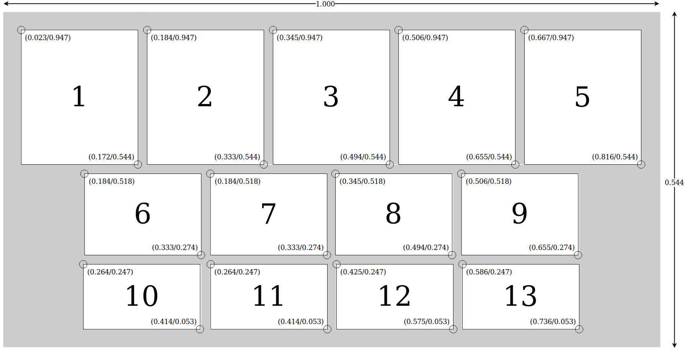
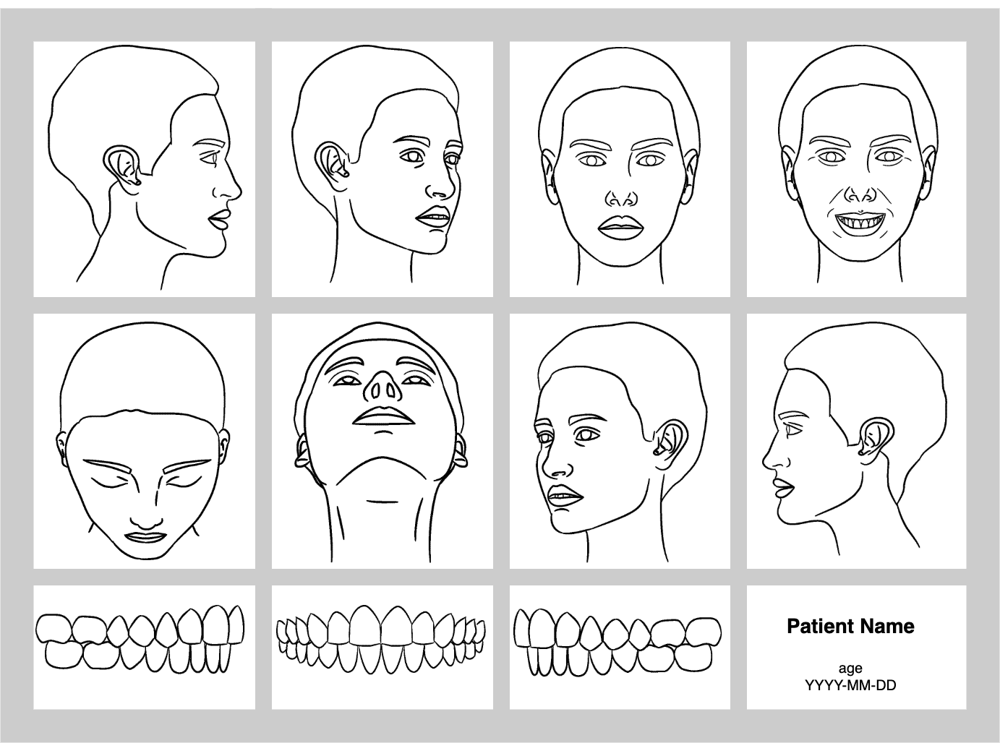
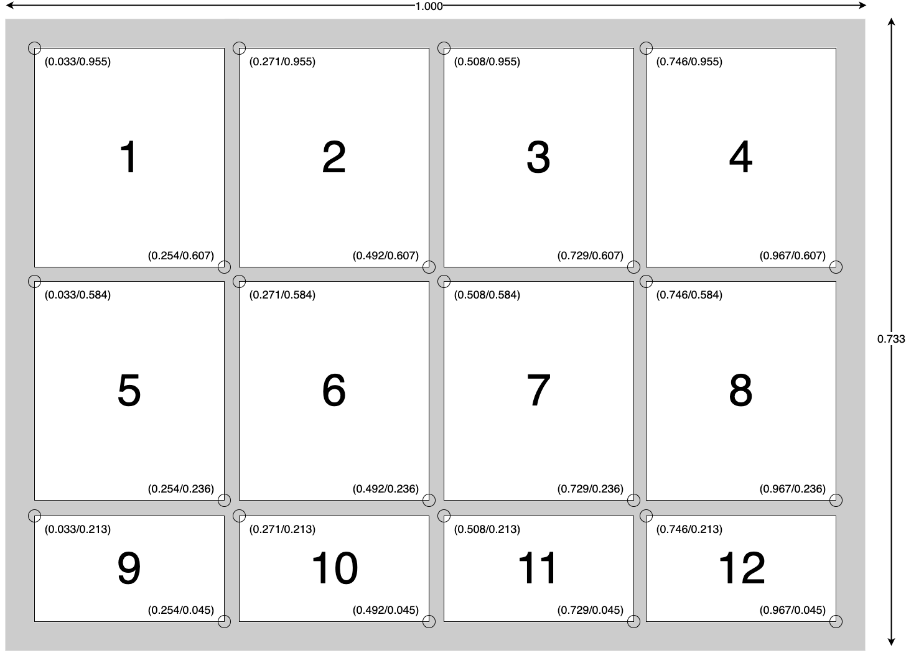

.. _view_set_examples:

Appendix B: ViewSet Examples
============================

The figures in this appendix are informative. Normative Image Display
requirements are specified in :ref:`Section 3.1.4.1.3.2
<viewset_display_requirements>`.

The figures were imported from the ADA 1100 working materials. The clinical
photographic example is included with the subject's authorization for
publication.

.. _viewset_vs01_examples:

Viewset VS-01
+++++++++++++

   Informative line-drawing example of VS-01.

   Informative clinical photographic example of VS-01.

   Informative VS-01 layout with normalized dimensions and positions.

.. _viewset_vs02_examples:

Viewset VS-02
+++++++++++++

   Informative line-drawing example of VS-02.

   Informative VS-02 layout with normalized dimensions and positions.

.. _viewset_vs03_examples:

Viewset VS-03
+++++++++++++

   Informative line-drawing example of VS-03.

   Informative VS-03 layout with normalized dimensions and positions.

.. _viewset_vs04_examples:

Viewset VS-04
+++++++++++++

   Informative line-drawing example of VS-04.

   Informative VS-04 layout with normalized dimensions and positions.
